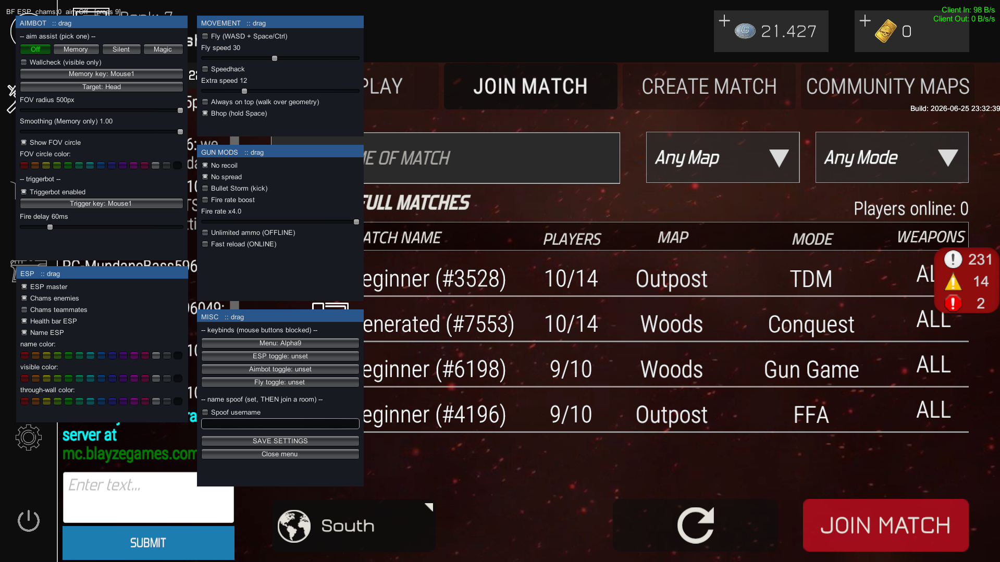

# Bullet Force Cheat

ESP · chams (walls) · aimbot (memory / silent / magic) · triggerbot · no recoil/spread · fly · speedhack · bhop · FOV circle — draggable menu, press **9**.

## Notes
- For the **Steam version** — `Build: 2026-06-25 23:32:39`.
- Made as a **MelonLoader** IL2CPP mod. The logic also ports fine to a **standalone injector** or a **standalone cheat**.
- **Source only, no DLL** — build it yourself.
- A game update is coming soon and **I will not be updating this**.
- If you use or port this, **credit me** — follish / dc: 8832.

## Build
1. Install **MelonLoader 0.7.3** (IL2CPP) on Bullet Force, launch once so it generates the assemblies.
2. Set `GameDir` in `bfesp.csproj` to your install path.
3. `dotnet build -c Release`, then drop `BFEsp.dll` into the game's `Mods` folder.

---

dev pls remove the bots and the absurd "Babiess" chat bot 🙏
